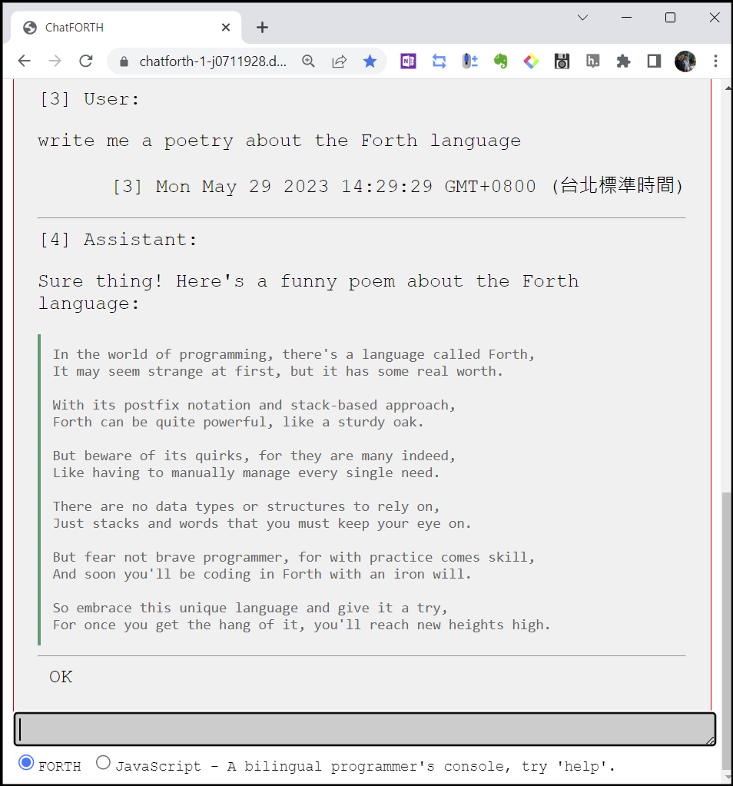

# ChatFORTH

FORTH, originally designed as a conversational environment, has evolved to include AI chatbot support with the addition of new commands. This development has transformed FORTH into an innovative and comfortable development environment with AI assistance always at your side. Unlike traditional chatbots that are solely for conversation, ChatFORTH is a genuine computer language environment where users can use AI through running programs to accomplish large amounts of work.

To start chatting on ChatFORTH, simply start your message with exactly one leading space or use the 'user:' command followed by your message. Additionally, you can utilize frequently used commands through macros without having to type them repeatedly. Context editing allows for redirection of conversations and error correction while providing more information for the AI to analyze data insights seamlessly.

Use `[tutor](https://chatforth-1-j0711928.deta.app/ChatFORTH/ChatFORTH.html?tutor)`, `[load_chatforth_book](https://chatforth-1-j0711928.deta.app/ChatFORTH/ChatFORTH.html?load_chatforth_book)`, `help`, `help *`, `help help:`, `help include`, `help save-page`, `help edit` or `manual-for-help:` commands to know more about ChatFORTH.
Try it now [ChatFORTH](https://chatforth-1-j0711928.deta.app/ChatFORTH/ChatFORTH.html)

## Features

### Forth programming language console
- Conversational environment with AI chatbot support
- Genuine computer language environment for running programs and accomplishing large amounts of work that can call AI to do things that were impossible before.
- Built on top of the [jeforth.3we](https://github.com/hcchengithub/jeforth.3we) project, which provides a powerful FORTH interpreter.

### Chatting commands 
- Context editing: Ability to redirect conversations and correct errors while providing more information for the AI to analyze data insights seamlessly.
- Conversation context management: Ability to save and restore conversation context using localStorage or local files, as well as prune conversation context to conserve tokens using `snip` command or `del` command.
- Integration with OpenAI GPT models such as text-davinci-003, ChatGPT 3.5 Turbo, and ChatGPT 4, etc., allowing users to switch between different AI models during chatting.
- Macro commands: Ability to define frequently used commands through macros without having to type them repeatedly.

## Technologies Used

- Forth Interpreter and Development Environment: The project uses [jeforth.3we](https://github.com/hcchengithub/jeforth.3we) as its Forth interpreter and development environment.
- Web Browser Environment: ChatFORTH is designed to run on web browsers such as Google Chrome or Edge. It can also be long-run programs using Node-Webkit to prevent it from stopping when the browser goes into power-saving mode while the user is away.
- API Server: The project uses [FastAPI](https://fastapi.tiangolo.com) for its API server.
- OpenAI ChatGPT Series: ChatFORTH utilizes the [OpenAI ChatGPT series](https://openai.com) for generating responses in conversations with users.
- Markdown to HTML Conversion: AI messages are converted from markdown format to HTML using [Showdown.js](https://github.com/showdownjs/showdown).

## Installation

### Main program ChatFORTH.html can be modified by yourself

Running ChatFORTH does not require any installation and works on Windows, Mac or Linux. To use ChatFORTH simply open [ChatFORTH](https://chatforth-1-j0711928.deta.app/ChatFORTH/ChatFORTH.html) in a web browser to start running it immediately. You can also save ChatFORTH.html to your local computer by using Ctrl+s from the page and run it on your local computer as well for further modifications if needed. If you do not have an OpenAI `API_KEY` (or other AI options such as Google Bard when it will be available), then please get one before proceeding further, `API_KEY` is necessary. 

### API server main.py 

"main.py" is an API server. When running "ChatFORTH.html", it will automatically search for an available API server either locally or on the deta.app website to resolve CORS policy problems. This "main.py" has been running on deta.app, so you do not need to run your own API server on your local computer. However, if deta.app fails or you have reasons to modify "main.py," then clone the project from GitHub and execute the 'python main.py' command within the directory where "main.py" resides after setting up your Python environment according to the requirements specified in requirements.txt.

## Questions and Suggestions

If you have any questions or suggestions regarding this project, please feel free to open an issue on our GitHub repository [here](https://github.com/hcchengithub/ChatFORTH/issues).

### I need your help!

- (issue #1) The FastAPI API server 'main.py' is hosted on [Deta.space](https://deta.space), and I have noticed that it frequently encounters a "Gateway error 502". Although it is not severe and can be recovered simply by retrying, how can this be improved? Should I consider moving to Microsoft Azure or Google GCP, or could the issue be with my main.py file?

- (issue #2) I would like someone to define a FORTH word or command called `summarize` that takes a URL as input and returns the summarized text of the given web page on ChatFORTH. Perhaps it could be a word that reads the URL, parses the main essay, and returns it to TOS. I can take care of the rest then. It would be great if this command could work not only with URLs but also with PDF files, Word files, and other formats.

- (issue #3) In addition to `summarize`, another useful command would be `translate` (as [seen in this example](https://raw.githack.com/hcchengithub/ChatFORTH/main/doc/README/Applying%20LLMs%20to%20Enterprise%20Data%20-%20Concepts,%20Concerns,%20and%20Hot-Takes.html) where ChatFORTH is already capable of it, but I want it to be further improved) that helps translate an article into ChatFORTH chat turns paragraph by paragraph. This is particularly helpful for reading foreign articles because we can easily save and restore context on ChatFORTH and even edit the article directly on ChatFORTH, allowing us to jot down our comments and making reading a wonderful experience.

- Your ideas too ... 

May the forth be with you!

